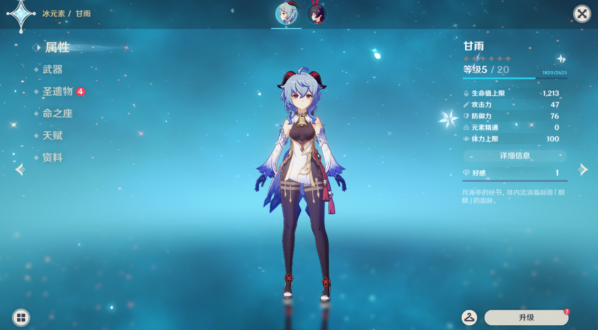
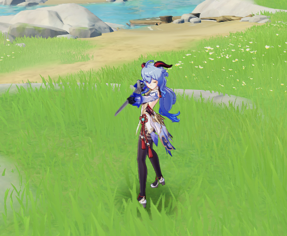

# Genshin Character Hack (ver 1.4)

Replace Lumin with a character of your choice so you can roam around the world with him/her.

## How it looks

Where it should show Lumin, the character model will be replaced with your selected character.

Since it only replaces data partially, you won't be able to use the character to attack unfortunately. And all characters will be use Lumin's sword.

## How it works

We intercept some function calls related to characters in the program and replace the occurence of Lumin with another character we have selected.

## How to use

* Install [Python 3](https://www.python.org/) and add it to `PATH`.
* Install [Frida](https://frida.re/docs/installation/).
* Edit `hook.py` and replace `game_dir` with the path to your game folder.
* Open `Command Prompt`in administrator mode.
* Run `python hook.py`.
* The game should start normally.
* Create a new Genshin account with Lumin. **The account used with this hack is going to be baned sooner or later**. Don't use an account that you can't afford to lose.
* Play with the new account until you get Amber. We need at least 2 characters for the character
swap to work.
* Create 2 teams, team 1 with Lumin, and team 2 with only Amber.
* Go back to `Command Prompt` and type `start` after the "command: " prompt.
* In the game, go to `Characters` screen and you should now see Ganyu instead of Lumin.
* Swap to team 2 with Amber, and then swap to team 1 with Lumin (now should appear as Ganyu).
* Now you should get Ganyu on the field and can walk/run with her.
* To switch to another character, type `next` in the `Command Prompt` and swap teams again.

## Will my account be baned for using this?

Yes. Genshin's anti-cheat kernel driver scans the program image in memory periodically and will detect that we have changed the program. Also Genshin sends a lot of data to their server so it may be possible to detect discrepencies in our local data and their remote data (this seems less likely than the kernel driver scan though).

## How can I use the character to attack?

Genshin stores all data (character, weapon, skill, etc.) on the server side and sends it back to the client when we swap characters. It may be possible to replace all these data with fake ones to make it work but so far I haven't made much progress on this.

If anyone is intrested in pursuing this, I'm happy to share what I have found so far.
